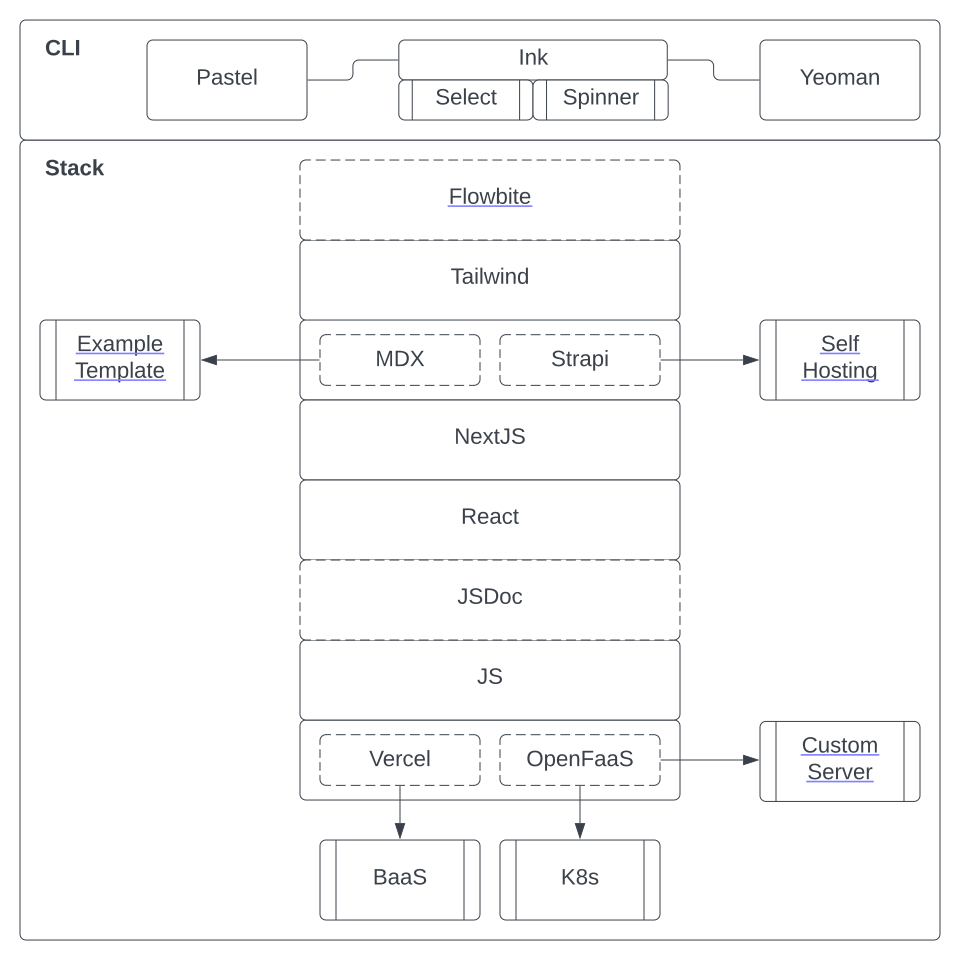

# create-swan-app
> JS (not Typescript), React, NextJS, Tailwind & Flowbite and more

## Dependencies


### CLI

| Name | Description | 
|:-----|:------------|
| [pastel](https://github.com/vadimdemedes/pastel) | NextJS-esque framework for CLI |
| [ink](https://github.com/vadimdemedes/ink) | React for CLI |
| [ink-select-input](https://www.npmjs.com/package/ink-select-input) | Select between options | 
| [ink-spinner](https://www.npmjs.com/package/ink-spinner) | GIF loader where needed |
| [yeoman](https://www.npmjs.com/package/yeoman-generator) | File template generator |

### Stack

| Name | Description | Optional | 
|:-----|:------------|:---------|
| JS | Language | No | 
| [React](https://react.dev/) | UI library | No | 
| [NextJS](https://nextjs.org/) | Backend framework for React. v13 with app directory support | No |
| [JSDoc](https://jsdoc.app/) | [Typedefs without Typescript](https://ianmitchell.dev/blog/using-intellisense-with-jsdoc) | Yes |  
| [MDX](https://mdxjs.com/) | Markdown in React components | Yes | 
| [Strapi](https://strapi.io/features) | FOSS, headless CRM | Yes | 
| [Tailwind](https://tailwindcss.com/) | CSS framework | Yes |
| [Flowbite](https://flowbite.com/) | React UI library | Yes |

### Deploy Target

| Name | Description | Type | 
|:-----|:------------|:---------|
| [Vercel](https://vercel.com/) | AWS wrapper platform & the company behind NextJS | Default |  
| [OpenFaaS](https://www.openfaas.com/) | [Custom Express server](https://nextjs.org/docs/pages/building-your-application/configuring/custom-server) for non-Vercel targets  | Optional | 

## Getting Started

### Initialization 
```
Pastel app created in create-swan-app:
$ cd create-swan-app

Build:
$ npm run build

Watch and rebuild:
$ npm run dev

Run:
$ create-swan-app
```

### Install

```bash
$ npm install --global create-swan-app
```

### CLI Usage

```
$ create-swan-app --help

  Usage
    $ create-swan-app

  Options
    --name  Your name

  Examples
    $ create-swan-app --name=Jane
    Hello, Jane
```
